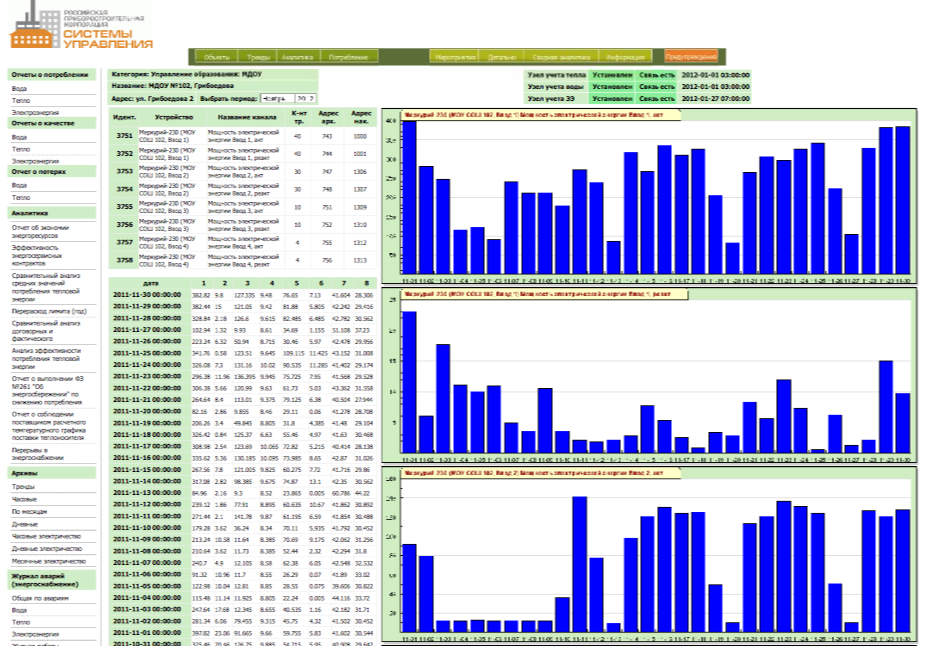
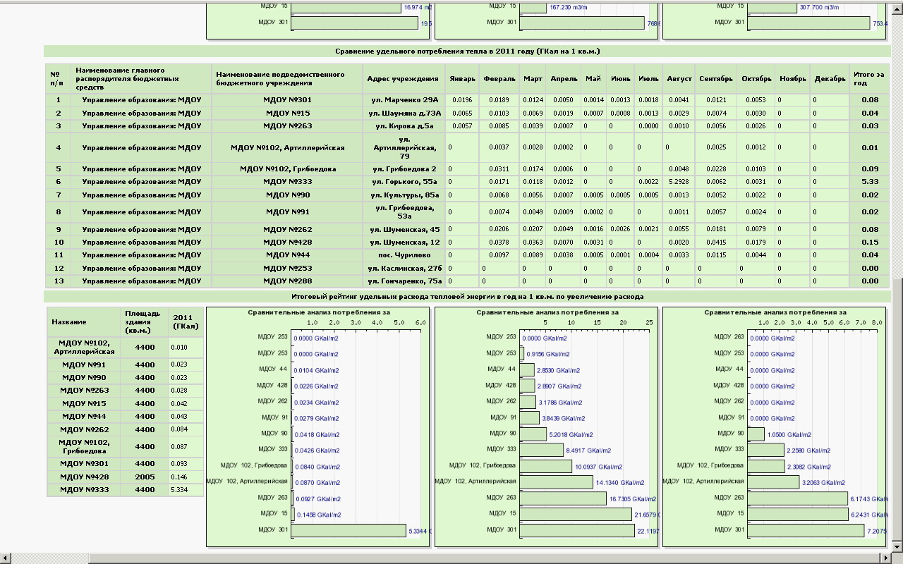
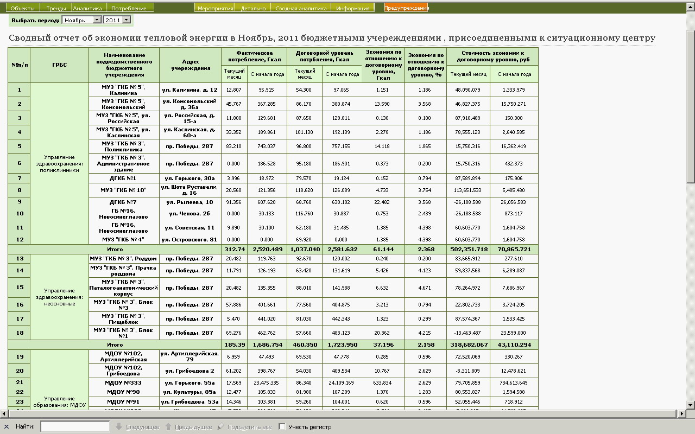
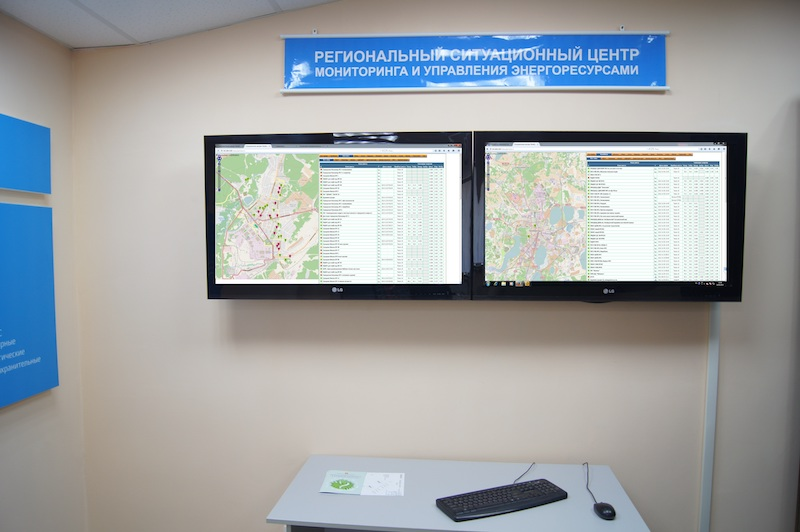

Интерфейс доступа к данным по энергопотреблению города.

Городские ситуационные центры (Челябинск, Златоуст, Миасс, Сатка). Программный комплекс ситуационного центра состоит из  компонентов: баз данных MySQL и Interbase, сервера сбора данных, веб-сервера (Apache), программ конвертации и обслуживания БД, пакета построения графических диаграмм (Jpgraph, HighCharts) и языка обработки скриптов (php). Веб-сервер обеспечивает доступ пользователей к данным ситуационного центра путем отображения интерфейса (табличный вывод и построение диаграмм с помощью пакетов Jpgraph, HighCharts).

